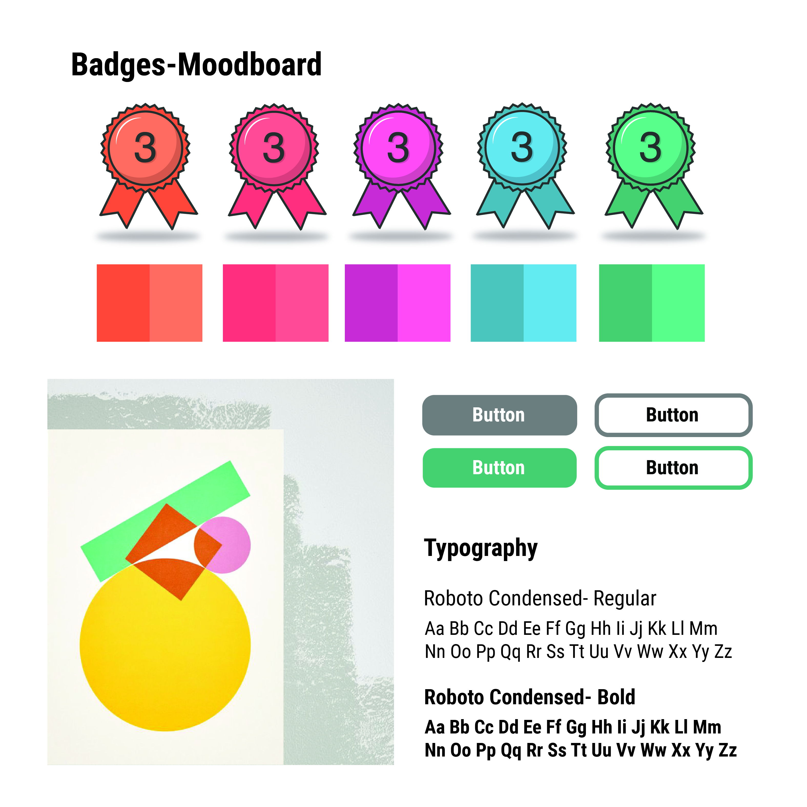

# Resources 

## Moodboard

The moodboard is intended to define the base styles that will be applied to the app.

## Clickable Prototypes

[admin-view clickable prototype](https://xd.adobe.com/view/7692282a-ac17-4a21-6bd7-86105ba2962d-00a3/)

[student-view clickable prototype](https://xd.adobe.com/view/0c2ff351-e264-495d-5749-9bb6d4c548df-7a1e/)

